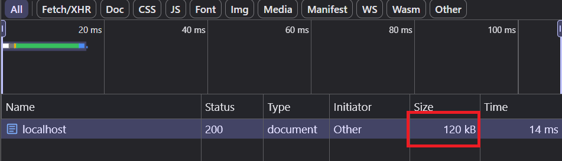
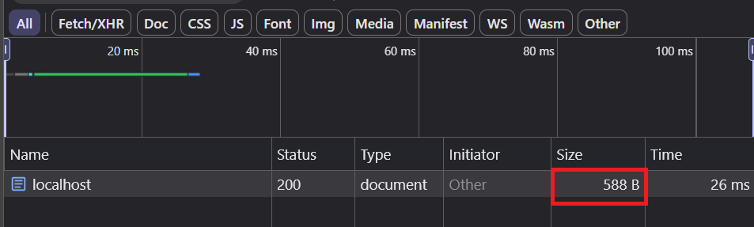

# why compression so important for http request

## 1: see this response size:

- before compression :

- after compression :

hint: compress body make reduce size of request but also consume more server resource.

but in normal: compress make api better . U can see size reduce 209X and response time grow more ms (14->26ms)

## 2: how do it

- install compression pack for your tech stack

- server not auto return encoding response, if you manual request without accept-encoding header then server return normal response.

## 3: The signs of using compression are the two headers

- Accept-Encoding and Content-Encoding.

- Currently, you don't need to worry about adding headers for both the server and client request as it is almost automatic, except for curl, which requires the request to explicitly specify the compression mechanism.

## note: demo with nodejs see it: [server.js](./server.js)
